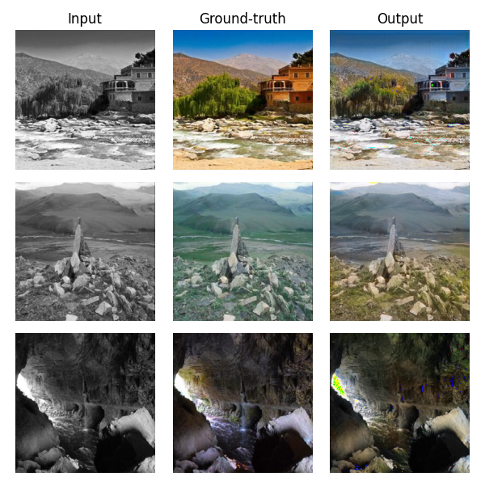

# Colorización de imágenes con GANs
Xander Gallegos 
+ <aranxa.gallegos@iteso.mx>

Este proyecto retoma la investigación anterior que abordó la colorización de imágenes mediante la implementación de autoencoders convolucionales ([Image-Colorization](https://github.com/xagallegos/Image-Colorization)). A pesar de que estos métodos demostraron cierto grado de capacidad para representar y generar imágenes a color, se encontró que los resultados obtenidos no cumplían con los estándares deseados en términos de claridad y calidad visual. Estas limitaciones han impulsado la exploración de nuevas metodologías, como las Generative Adversarial Networks (GANs). Esta arquitectura de redes neuronales ha demostrado habilidades destacadas en la generación de datos realistas y la captura de distribuciones de alta dimensión, lo que motiva la transición hacia el uso de GANs en este proyecto para abordar nuevamente el desafío de la colorización de imágenes en escala de grises.

## Resultados

Este proyecto se fundamenta completamente en el paper [*"Image-to-Image Translation with Conditional Adversarial Networks"*](https://arxiv.org/pdf/1611.07004.pdf) o más conocido como pix2pix, que propone una solución general a varios problemas de image-to-image, incluida la colorización. Además, se implementan modificaciones en el generador inspiradas en las propuestas de Moein Shariatnia en su [repositorio de GitHub](https://github.com/moein-shariatnia/Deep-Learning/tree/main/Image%20Colorization%20Tutorial). Estas adaptaciones buscan mejorar aún más el rendimiento y la calidad de la colorización de imágenes en escala de grises mediante la optimización de la arquitectura del generador dentro del marco de pix2pix.

## Datos
Para el entrenamiento del modelo, se optó por utilizar el dataset Places365 debido a su amplia diversidad de entornos, lo que se espera haya permitido al modelo aprender características representativas de una amplia gama de escenarios y haya contribuido al poder de generalización del modelo. Cabe aclarar que, dado el tamaño considerable del dataset completo, se utilizó un subset de más de 36k imágenes obtenido de [Kaggle](https://www.kaggle.com/datasets/pankajkumar2002/places365) más acorde con los recursos destinados al proyecto.

## Arquitectura
### Generador
Se hace uso de un modelo pre-entrenado de ResNet-18 como base para el “encoder” del generador. Este modelo tiene una arquitectura que consiste principalmente en capas convolucionales, de agrupación (como MaxPoolig o AvgPooling) y de normalización, todas estas organizadas en bloques y con función de activación ReLU. Estos bloques residuales permiten capturar características complejas y facilitan el entrenamiento de redes profundas sin que se degrade el rendimiento durante el proceso.

Se opta por llenar la parte del “decoder” del modelo utilizando una Dynamic U-Net debido a que sus conexiones de salto entre las capas del encoder y del decoder permitien el acceso a características de diferentes escalas espaciales para mejorar la precisión en la generación de imágenes, corrigiendo así los problemas que se tuvieron en la implementación previa de este problema. En conjunto con la base preentrenada de ResNet-18 como encoder, esta combinación proporciona una arquitectura robusta y flexible para la generación de imágenes, garantizando un rendimiento óptimo y una adaptabilidad a diversos escenarios de generación de imágenes.

### Discriminador
Se hace uso un discriminador por patch, en este, el modelo generará una salida para cada patch, el cual consiste en un cuadrado de $n \times n$ pixeles, decidiendo individualmente para cada patch si es falso o real. La arquitectura consistirá en bloques de capas convolucionales con activación ReLU y normalización por lotes. Utilizar este tipo de modelo para la colorización parece razonable ya que las modificaciones locales requeridas por la tarea son cruciales. Quizás decidir sobre toda la imagen, como lo hace un discriminador convencional, podría pasar por alto las sutilezas involucradas en esta tarea.

## Función de pérdida
Como función de pérdida se usa `BCEWithLogitsLoss`, esta combina una capa sigmoidal y binary cross entropy en una sola clase, lo que la hace más estable numéricamente que usar un sigmoide simple seguido de un BCE. Para el generador se minimiza la probabilidad de clasificación correcta por parte del discriminador, mientras que para para el discriminador se maximiza la probabilidad de clasificación correcta entre las imágenes reales y falsas.

## Métricas de evaluación
Tomando como referencia el trabajo de Isola et al. (2017) en *‘Image-to-Image Translation with Conditional Adversarial Networks’*, el objetivo final de trabajos como la colorización suele ser la plausibilidad para un observador humano, por lo tanto, se evaluará el modelo usando este enfoque.

## Conclusiones
Los resultados obtenidos superaron ampliamente las expectativas dadas las limitaciones de recursos y tiempo asignados al proyecto. Sin embargo, se han identificado algunos problemas significativos en el modelo. Por ejemplo, al enfrentarse a imágenes con áreas muy blancas, las cuales son atípicas en la distribución de colores del conjunto de datos, el modelo tiende a generar rellenos con colores que resultan claramente incorrectos para el ojo humano. No obstante, se plantea la hipótesis de que estos problemas podrían corregirse fácilmente con más entrenamiento, posiblemente mediante una orientación específica hacia este tipo de imágenes.
